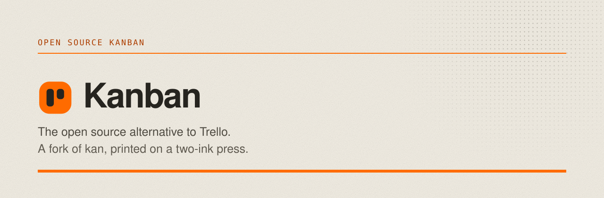

<picture>
  <source media="(prefers-color-scheme: dark)" srcset=".github/brand/banner-dark.svg">
  
</picture>

## This is a fork of kan

The application is **not** our work. It is
**[kanbn/kan](https://github.com/kanbn/kan)**, written by
[Henry Ball](https://github.com/hjball) and its
[contributors](https://github.com/kanbn/kan/graphs/contributors). They
built the product; we printed a design system on top of it.

kan is licensed **AGPL-3.0**, and so is this fork. That licence is the
only reason this repository may exist, and it is an obligation as much
as a permission: run a modified copy of this over a network and you owe
your users its source.

If this is useful to you, the thanks belong upstream —
**[kan.bn](https://kan.bn)** · [Docs](https://docs.kan.bn) ·
[Discord](https://discord.gg/e6ejRb6CmT) ·
[Star it](https://github.com/kanbn/kan)

## What we changed

One thing: the way it looks.

It is printed rather than rendered — a two-ink screenprint, safety
orange and graphite on bone paper, with plates instead of cards, rules
instead of shadows, and motion borrowed from a press. The type is the
system stack; there are no webfonts, no glass, no gradients and no
glow. Every ink clears WCAG AA on every ground in both builds, and
that is asserted rather than assumed:

```bash
node tooling/design/contrast.mjs
```

The whole argument lives in **[DESIGN.md](DESIGN.md)** — values, and
the reason beside each one, because a rule stripped of its reason gets
undone by the next person who finds it inconvenient.

## Run it

```bash
cp .env.example .env   # set BETTER_AUTH_SECRET and POSTGRES_PASSWORD
docker compose up -d
```

Compose pulls this fork's images by default. Override `WEB_IMAGE` and
`MIGRATE_IMAGE` in `.env` to pin a tag, or to run upstream instead.

Locally:

```bash
pnpm install
pnpm db:push
pnpm dev
```

Everything else — environment variables, S3, OAuth providers, Trello
imports, the MCP server — is upstream's work, and upstream's docs are
the canonical reference: **[docs.kan.bn](https://docs.kan.bn)**.
`apps/docs` here is a restyled copy of theirs, so when the two
disagree, believe theirs.

## Licence

[AGPL-3.0](LICENSE), inherited from
[kan](https://github.com/kanbn/kan). The design system in `DESIGN.md`
and the brand are ours; the application under them is not.
